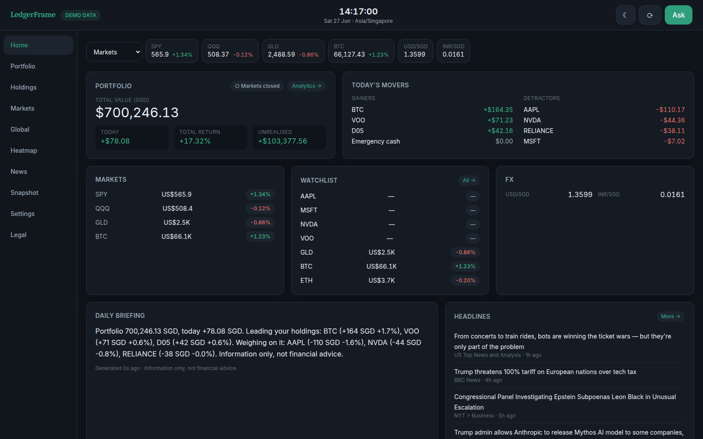
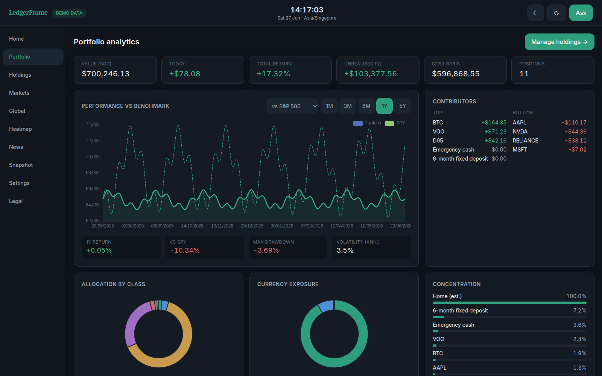
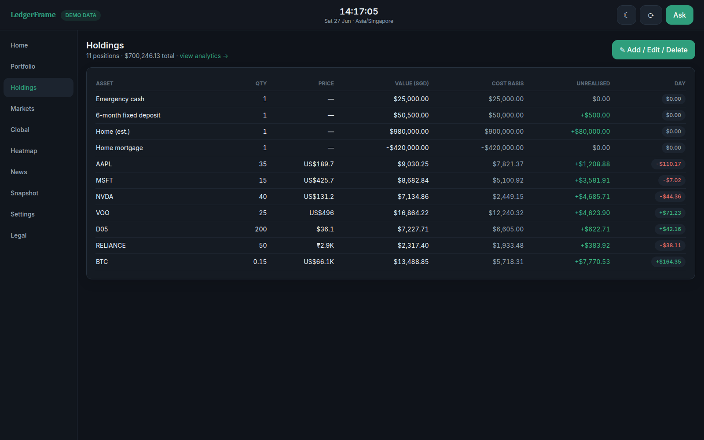
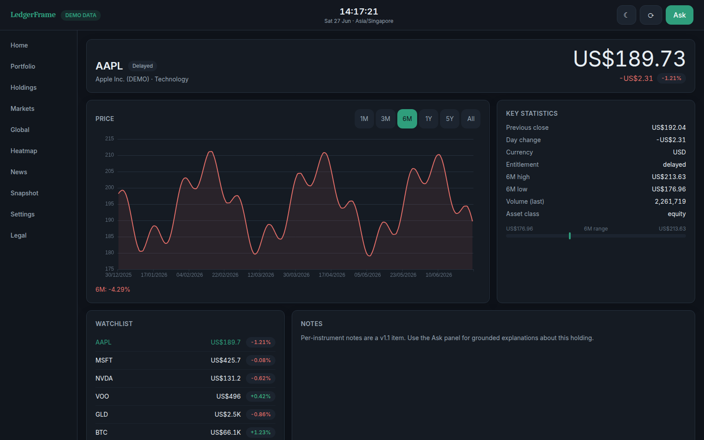
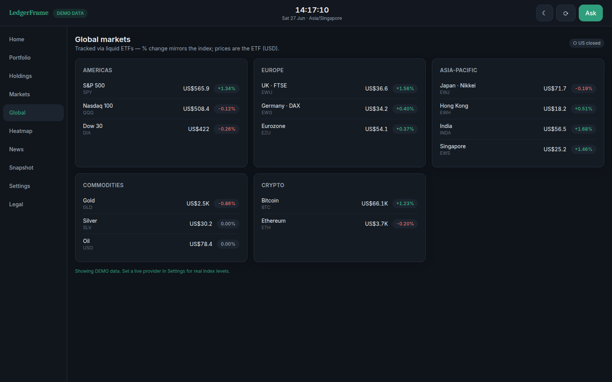
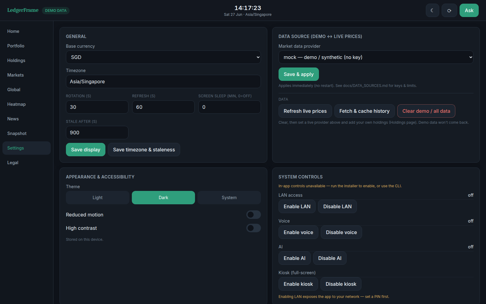
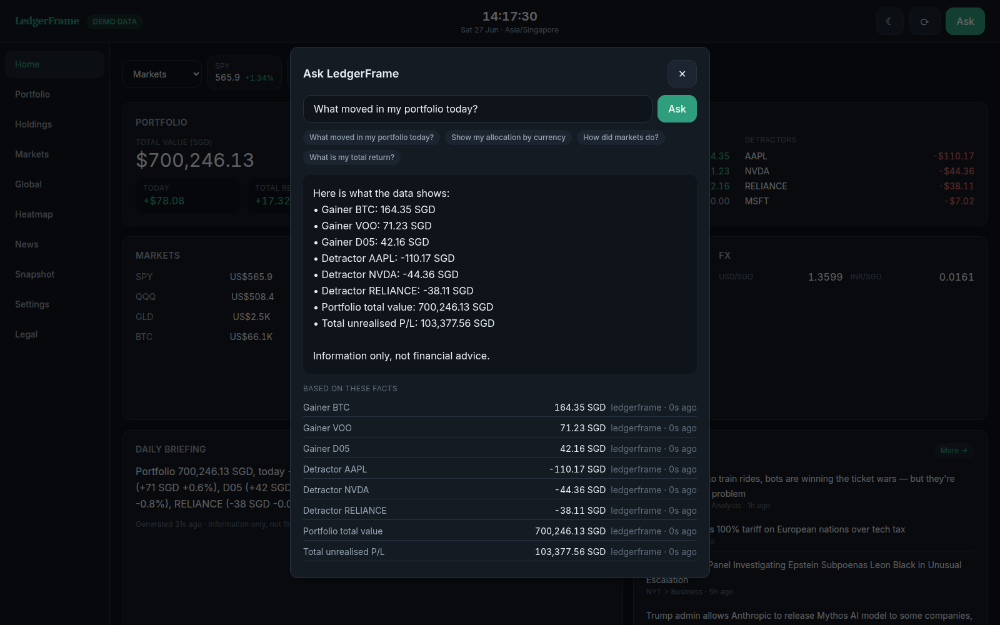
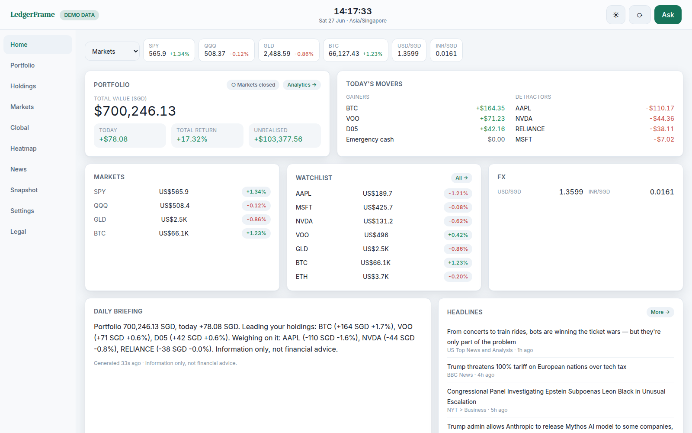
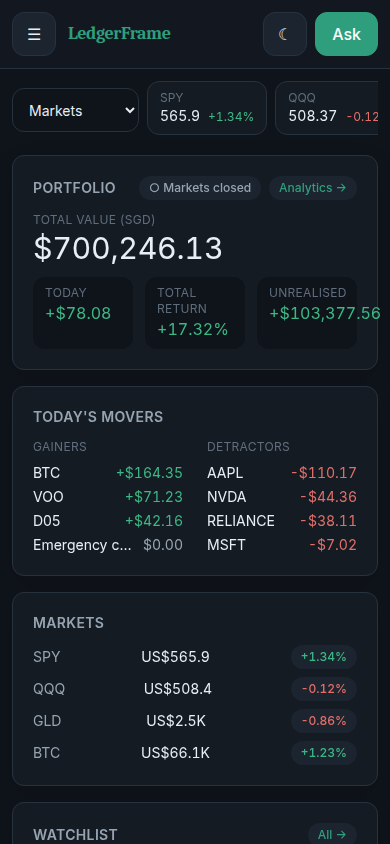

# LedgerFrame

[](https://github.com/gopalasubramanium/LedgerFrame)
[](LICENSE)
[](ARCHITECTURE.md)

**A local-first, always-on personal financial intelligence display for Raspberry Pi 5 + Hailo AI HAT+ 2.**

A private, self-hosted "wealth desk": market monitoring, portfolio & net-worth
tracking, benchmarked performance analytics, world-market views, optional local
voice, and **grounded** AI explanations — all on your own hardware. Your data stays
on the device by default; nothing leaves it unless you configure it to.

> **Not a trading platform.** No order placement, no brokerage integration, no
> buy/sell recommendations, no financial advice.

**Contents:** [Screenshots](#screenshots) · [Highlights](#highlights) ·
[The pages](#the-pages) · [Runs anywhere](#runs-anywhere) · [Install](#install) ·
[Data providers](#data-providers-settings--data-source) ·
[AI providers](#ai-providers-settings--ai-assistant) · [Usage](#usage-typical-flow) ·
[Maintenance](#maintenance) · [Limitations](#limitations) · [License](#license)
· [Operations](OPERATIONS.md) · [Architecture](ARCHITECTURE.md) ·
[Security](SECURITY.md) · [Data sources](docs/DATA_SOURCES.md) · [Changelog](CHANGELOG.md)

## Screenshots



| | |
|---|---|
| **Portfolio analytics** — benchmarked performance, allocation, key stats | **Holdings** — the one place to add/edit/delete positions |
|  |  |
| **Instrument** — price, period chart, stats, watchlist | **Global** — world markets via liquid ETF proxies |
|  |  |
| **Settings** — data source, AI, theme, system controls | **Grounded AI** — answers cite the facts they're built from |
|  |  |

Light theme & mobile are first-class:

| Light theme | Mobile |
|---|---|
|  |  |

---

## Highlights

- **Local-first & offline-capable** — last-known data is kept and clearly marked
  *stale*; the dashboard never goes blank.
- **Deterministic engine** — valuations, FIFO cost basis, allocations, net worth,
  and risk stats are computed in Python with `Decimal`. **The AI never calculates a number.**
- **Grounded AI** — answers are built only from verified, timestamped facts; the
  model explains, it never invents. Falls back to deterministic templates when no
  model is available.
- **Honest market data** — runs in **DEMO mode** out of the box; switch to a live
  provider from Settings. A live provider that can't serve a symbol shows "—",
  never a fabricated price.
- **Wealth-manager UI** — slate + emerald design, **light / dark / system** themes,
  benchmark picker, key-stats panel, responsive on phone and desk display.
- **Private by design** — localhost-only by default, Argon2 PIN (auto-prompts on
  expiry), encrypted backups (`age`), no telemetry.

## The pages

| Page | Purpose |
|------|---------|
| **Home** | Glanceable "now": ticker, portfolio headline, movers, markets, watchlist, FX, briefing, headlines |
| **Portfolio** | Analytics: benchmarked performance, allocation & currency donuts, concentration, key statistics |
| **Holdings** | The only place to **add / edit / delete** transactions & manual assets (CSV import too) |
| **Markets** | *Your* markets — a view dropdown (holdings/watchlist/equities/…) + symbol search |
| **Global** | World markets by region via liquid ETF proxies (so live data works) |
| **Heatmap** | Performance treemap across your instruments |
| **News** | Free RSS/Atom headlines + the grounded AI briefing |
| **Snapshot** | Net worth, assets, liabilities, cash, net-worth history |
| **Settings** | Data source, AI provider, theme, news feeds, PIN, system controls, backups |

---

## Runs anywhere

LedgerFrame started as a Raspberry Pi project but **runs on any machine** — Linux,
macOS, or Docker on any host. **The Raspberry Pi and the Hailo AI HAT+ are
optional**: without them you simply lose the kiosk display and on-device AI (the
assistant falls back to local Ollama / an OpenAI-compatible endpoint, or to
deterministic fact-only answers). Everything else — portfolio, analytics, market
data, news, themes — works identically.

## Install

### Docker (any machine — simplest)

```bash
git clone https://github.com/gopalasubramanium/LedgerFrame.git && cd LedgerFrame
export LEDGERFRAME_SECRET_KEY=$(python3 -c "import secrets;print(secrets.token_urlsafe(48))")
docker compose up -d --build
```

Open **http://localhost:8321**. Data persists in the `ledgerframe-data` volume.
Runs the API + background worker in DEMO mode; switch to live data and configure
everything from **Settings**. (If you expose it beyond localhost, set a PIN.)

### Raspberry Pi 5 (guided)

```bash
cd ~
sudo apt update && sudo apt install -y git
git clone https://github.com/gopalasubramanium/LedgerFrame.git
cd ~/LedgerFrame && ./scripts/install.sh
```

The installer is interactive and idempotent: it auto-detects the platform, installs
missing prerequisites (`uv`, Node, build tools, `age`, Chromium for kiosk), helps
pick/create the data folder on your USB SSD (**never formats anything**), sets up
systemd services + a scoped admin helper, builds the dashboard, and runs a health
check. A complete **no-experience walkthrough** (flashing the OS, etc.) is in
[`OPERATIONS.md`](OPERATIONS.md). Verify anytime with `./scripts/doctor.sh`.

Open **http://127.0.0.1:8321** on the Pi. To reach it from your phone/laptop:
`./scripts/install.sh --enable-lan --yes` (set a PIN when prompted).

### Development (any Linux/macOS)

```bash
git clone https://github.com/gopalasubramanium/LedgerFrame.git && cd LedgerFrame
cp .env.example .env
export LEDGERFRAME_DATA_DIR="$PWD/data" LEDGERFRAME_ENV=development
uv venv && source .venv/bin/activate && uv pip install -e ".[dev]"
(cd frontend && npm install)
./scripts/start-dev.sh     # API :8321 + Vite :5173
```

Boots in **DEMO mode** with seeded holdings and synthetic data — no keys or network.

---

## Data providers (Settings → Data source)

Switch any time; changes apply **immediately** (no restart). Failures are honest —
unavailable symbols show "—", and **Refresh live prices** lists what updated/failed.

| Provider | Cost | Covers | Notes |
|----------|------|--------|-------|
| `mock` | free | everything (synthetic) | Default DEMO mode; clearly labelled |
| `csv` | free | local `imports/<SYMBOL>.csv` | Offline/manual history |
| `alphavantage` | free/paid | **US equities & ETFs, crypto, FX** | Add your key in Settings |

**Alpha Vantage specifics** (important):
- ✅ US equities & ETFs, ✅ crypto (BTC/ETH/…), ✅ FX.
- ❌ Raw indices (`^GSPC`) — the **Global** page uses ETF proxies (SPY, QQQ, EWJ, …)
  so live values still show. ❌ Most non-US tickers (need region suffixes) — add
  those as **manual-priced** holdings.
- History is **cached** in the DB; **Fetch & cache history** backfills new holdings
  only (won't re-spend quota). Free tier ≈ 25 req/day; premium raises it.

Full detail & licensing: [`docs/DATA_SOURCES.md`](docs/DATA_SOURCES.md).

## AI providers (Settings → AI assistant)

The AI only ever *explains* verified facts. Choose:

| Option | Data leaves device? | Use |
|--------|---------------------|-----|
| **Hailo / Ollama (local)** | No | On-device model — set the service URL (Hailo `:8000` or Ollama IP `:11434`) + model |
| **OpenAI-compatible** | **Yes** | OpenAI / OpenRouter / Anthropic / remote Ollama (base URL + key + model; presets included) |
| **Disabled** | No | Deterministic, fact-only answers |

Saving tests the connection. Without any model, "Ask" still answers from your data.

## Usage (typical flow)

1. **Settings → Data source** → pick a provider (+ key) → **Clear demo / all data**.
2. **Holdings → Add / Edit / Delete** → enter your transactions (or import a CSV).
3. **Settings → Refresh live prices**, then **Fetch & cache history**.
4. **Home** for the daily glance; **Portfolio** for analytics; tap any symbol for its page.
5. **Ask** (top-right) for grounded explanations; set a **PIN** in Settings.

## Maintenance

| Action | How |
|--------|-----|
| Update | `./scripts/update.sh` (backs up, syncs, rebuilds, migrates, restarts) |
| Back up / restore | `./scripts/backup.sh` · `./scripts/restore.sh <file> [--force]` (or Settings → Create backup) |
| Refresh / history / clear data | Settings → *Data source* buttons |
| Restart / diagnostics | Settings → *Service & maintenance*, or `sudo systemctl restart ledgerframe-api ledgerframe-worker` |
| Health / hardware report | `./scripts/doctor.sh` · `curl http://127.0.0.1:8321/health` |
| Benchmark | `./scripts/benchmark.sh` |
| Reset to demo | `./scripts/reset-demo-data.sh` |
| Tests | `pytest` · `cd frontend && npm test && npx playwright test` |

More: [`OPERATIONS.md`](OPERATIONS.md) · [`SECURITY.md`](SECURITY.md) ·
[`ARCHITECTURE.md`](ARCHITECTURE.md) · [`docs/`](docs/).

## Limitations

- **Not real-time** — bundled providers are demo/delayed/EOD; entitlement & staleness
  are shown on every quote.
- **Alpha Vantage free tier (~25/day)** can't sustain an always-on multi-symbol
  display; caching stretches it, but a less-restrictive feed is better for live use.
- **Small local AI** explains concisely; it's not an analyst, and degrades to
  fact-only answers when unavailable.
- Validated on x86_64 dev hardware; Pi/Hailo paths are guarded — run `doctor.sh` on
  the device.

## License

MIT — see [`LICENSE`](LICENSE). Market data & external providers are subject to their
own terms ([`docs/DATA_SOURCES.md`](docs/DATA_SOURCES.md)).
