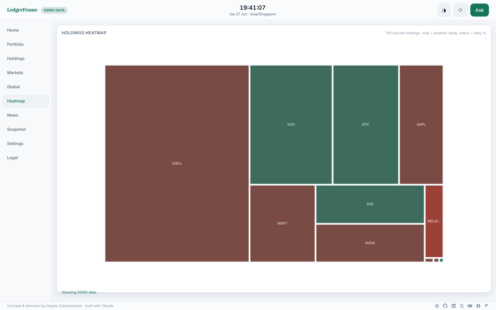

# LedgerFrame

[](https://github.com/gopalasubramanium/LedgerFrame)
[](LICENSE)
[](ARCHITECTURE.md)

**A local-first, always-on personal financial intelligence display for Raspberry Pi 5 + Hailo AI HAT+ 2.**

LedgerFrame is a private, self-hosted financial command centre: market monitoring,
portfolio & net-worth tracking, interactive dashboards, optional local voice, and
grounded AI explanations — all running on your own hardware. Your portfolio data
stays on the device by default. Nothing is sent off-device unless you explicitly
configure it.

> This is **not** a trading or execution platform. It contains no order placement,
> no brokerage integration, and gives no buy/sell recommendations or financial advice.

<table>
  <tr>
    <td width="50%"><br><sub><b>Home</b> — dashboard in DEMO mode.</sub></td>
    <td width="50%"><br><sub><b>Portfolio</b> — allocation, currency exposure, and FIFO-valued holdings.</sub></td>
  </tr>
  <tr>
    <td width="50%"><br><sub><b>Ask</b> — grounded AI: every answer cites the verified facts it was built from, with source + timestamp, and never invents numbers.</sub></td>
    <td width="50%"><br><sub><b>Heatmap</b> — treemap sized by value, coloured by daily change, with a data-coverage note.</sub></td>
  </tr>
</table>

<sub>More views — markets, news, snapshot, and settings — in <a href="docs/screenshots/"><code>docs/screenshots/</code></a>.</sub>

---

## Highlights

- **Local-first & offline-capable** — last-known data is kept and clearly marked
  *stale* when connectivity drops. The dashboard never goes blank.
- **Deterministic financial engine** — all valuations, FIFO cost basis, allocations,
  and net worth are computed in Python with `Decimal`. The AI never calculates a number.
- **Grounded AI** — answers are built only from verified, timestamped facts produced
  by the backend; the model explains, it does not invent. Falls back to deterministic
  templates when the Hailo NPU is unavailable.
- **Provider-abstracted market data** — runs fully in **DEMO mode** (synthetic data,
  no API key) out of the box; swap in a CSV source or an opt-in external provider.
- **Private by design** — localhost-only binding, Argon2 PIN lock, encrypted backups
  (`age`), no telemetry, secrets kept out of the repo.

See `docs/` for architecture, security, data sources, voice setup, and testing.

---

## Quick start (development / any Linux/macOS machine)

```bash
git clone <your-repo-url> LedgerFrame && cd LedgerFrame
cp .env.example .env
# For local dev, point the data dir somewhere writable:
export LEDGERFRAME_DATA_DIR="$PWD/data" LEDGERFRAME_ENV=development

# Backend
uv venv && source .venv/bin/activate
uv pip install -e ".[dev]"
ledgerframe              # serves API on http://127.0.0.1:8321

# Frontend (separate terminal)
cd frontend && npm install && npm run dev   # http://127.0.0.1:5173
```

Open <http://127.0.0.1:5173> in development, or <http://127.0.0.1:8321> once the
frontend is built (`npm run build`) and served by the API.

The app boots in **DEMO mode** with seeded holdings, watchlists, and synthetic
market data — no keys or network required.

---

## 🟢 Setup guide for everyone (no experience needed)

This walkthrough assumes **zero technical background**. Follow it top to bottom and
you'll have LedgerFrame running on your screen. It takes about 30–45 minutes, most
of which is the computer doing the work while you wait. ☕

> **You can't break anything.** The installer never erases or formats your drives —
> it only creates one folder and asks before each step. If you get stuck, jump to
> [Help, something went wrong](#-help-something-went-wrong) at the bottom.

### What you'll need (shopping list)

| Item | Notes |
|------|-------|
| Raspberry Pi 5 (8 or 16 GB) | The little computer that runs everything |
| Raspberry Pi AI HAT+ 2 (Hailo-10H) | *Optional* — only needed for the AI answers. Everything else works without it |
| Official Pi 5 power supply | Use the real one; underpowered chargers cause crashes |
| microSD card (32 GB+) | Holds the operating system |
| USB 3 SSD/“NVMe” drive | Where your data is stored. Plug into a **blue** USB port |
| A monitor + HDMI cable | Any TV/monitor with HDMI works (use the Pi's `HDMI0` port) |
| USB keyboard + mouse | For the one-time setup. A touchscreen is optional |

### Step 1 — Put the operating system on the card

1. On any computer, download and install **Raspberry Pi Imager** from
   <https://www.raspberrypi.com/software/>.
2. Insert your microSD card.
3. Open Imager → **Choose Device:** Raspberry Pi 5 → **Choose OS:** *Raspberry Pi OS (64-bit)*
   → **Choose Storage:** your microSD card.
4. Click **Next**, then **Edit Settings**. Set a **username and password** you'll
   remember, your **Wi-Fi name + password**, and your **time zone**. Save.
5. Click **Write** and wait. When it finishes, remove the card.

### Step 2 — Assemble and switch on

1. (If you have the AI HAT+ 2, fit it onto the Pi per its little instruction card first.)
2. Insert the microSD card into the Pi. Plug in the **monitor (HDMI0)**, **keyboard**,
   **mouse**, and your **USB SSD** (into a blue USB 3 port).
3. Plug in the **power supply** last. The Pi turns on automatically and, after a
   minute or two, shows a desktop.

### Step 3 — Make the USB drive ready (one click)

Raspberry Pi OS usually mounts your USB SSD automatically — you'll see it pop up in
the **Files** app. That's all that's needed; the installer finds it for you. *(If a
window asks whether to “open” the drive, you can just close it.)*

### Step 4 — Open the Terminal

Click the **black square icon** (`>_`) in the top bar, **or** press
**Ctrl + Alt + T**. A window with text appears. You'll type three short lines into
it — copy each line, paste with **Ctrl + Shift + V**, then press **Enter**.

### Step 5 — Download and install LedgerFrame

Paste these commands one at a time (wait for each to finish). The first line
(`cd ~`) makes sure you start from your home folder:

```bash
cd ~
sudo apt update && sudo apt install -y git
git clone https://github.com/gopalasubramanium/LedgerFrame.git
cd ~/LedgerFrame && ./scripts/install.sh
```

The installer now **guides you with simple questions** and sensible defaults — you
can just press **Enter** to accept each one:

- *“Data folder”* → press **Enter** (it auto-picks your USB drive).
- *“Start in DEMO mode?”* → **Enter** for **Yes** (safe sample data, no signups).
- *“Auto-launch the full-screen dashboard?”* → **Enter** for **Yes**.
- *“Install optional voice control?”* → **Enter** for **No**.
- *“Proceed with installation?”* → **Enter** for **Yes**.

It then installs everything itself (you may be asked for your password once). When
it prints **“✓ All done!”**, you're finished.

### Step 6 — See your dashboard

Open the **Chromium** web browser on the Pi and go to:

```
http://127.0.0.1:8321
```

You'll see the LedgerFrame dashboard with sample data. 🎉 To make it launch
**full-screen automatically every time you turn on the Pi**, just restart it:

```bash
sudo reboot
```

### Step 7 — Make it yours

- Click **Settings** → set a **PIN** so only you can make changes.
- Try the **Ask** button (top right) and tap a suggested question.
- Everything you see is **safe demo data**. When you're ready for real prices or AI
  answers, see [Going beyond demo mode](#going-beyond-demo-mode) below.

---

## Install (for technical users)

One line, fully guided:

```bash
./scripts/install.sh
```

Or unattended with explicit choices:

```bash
./scripts/install.sh --data-dir /mnt/ledgerframe-data --enable-kiosk --enable-voice false --demo-mode true --yes
```

The installer auto-detects your platform, installs missing prerequisites (`uv`,
Node, build tools, `age`, and Chromium when kiosk is enabled), helps pick/create the
data folder on an existing mount (never formats), and shows a plan before changing
anything. Preview without installing:

```bash
./scripts/install.sh --dry-run     # show the plan, change nothing
./scripts/install.sh --help        # all options
```

Then verify the hardware & runtime:

```bash
./scripts/doctor.sh
```

Full operational guide: [`OPERATIONS.md`](OPERATIONS.md). Hardware/AI setup and
constraints: [`ARCHITECTURE.md`](ARCHITECTURE.md) and [`docs/ASSUMPTIONS.md`](docs/ASSUMPTIONS.md).

### Going beyond demo mode

- **Live prices:** edit `.env` → set `LEDGERFRAME_MARKET_PROVIDER` and a key. See
  [`docs/DATA_SOURCES.md`](docs/DATA_SOURCES.md) for providers, licensing, and limits.
- **Local AI answers:** fit the AI HAT+ 2 and install the Hailo stack + `hailo-ollama`
  (see [`ARCHITECTURE.md`](ARCHITECTURE.md)). Without it, the app still answers using
  your data — it just won't phrase things in natural language.
- **Your own holdings:** **Settings → import a CSV**, or add transactions manually.

---

## 🆘 Help, something went wrong

| What you see | What to do |
|--------------|------------|
| The browser says “can't connect” | Wait 30 seconds and refresh. Still stuck? Run `./scripts/doctor.sh` in the Terminal — it checks everything and tells you what's missing |
| Installer said the data folder doesn't exist | Your USB drive isn't mounted. Open the **Files** app, click the drive once so it mounts, then re-run the install command |
| It asks for a password | That's normal — type your Pi login password (the letters won't show as you type) and press Enter |
| Want to start over | Just run `cd ~/LedgerFrame && ./scripts/install.sh` again — it's safe to re-run |
| Want to remove it | `./scripts/uninstall.sh` — your data and backups are kept |

The installer is safe to run as many times as you like. It never touches your data
or formats any drive.

---

## Day-to-day commands

| Action            | Command                                                        |
|-------------------|----------------------------------------------------------------|
| Start (dev)       | `ledgerframe`                                                  |
| Start services    | `sudo systemctl start ledgerframe-api ledgerframe-worker`      |
| Stop services     | `sudo systemctl stop ledgerframe-api ledgerframe-worker`       |
| Status / health   | `curl http://127.0.0.1:8321/health` · `./scripts/doctor.sh`    |
| Update            | `./scripts/update.sh`                                          |
| Back up           | `./scripts/backup.sh`                                          |
| Restore           | `./scripts/restore.sh <backup-file>`                           |
| Benchmark         | `./scripts/benchmark.sh`                                       |
| Reset demo data   | `./scripts/reset-demo-data.sh`                                 |
| Run tests         | `pytest` · `cd frontend && npm test`                           |

---

## License

MIT. See `LICENSE`. Market data and any external providers are subject to their own
terms — see [`docs/DATA_SOURCES.md`](docs/DATA_SOURCES.md).
